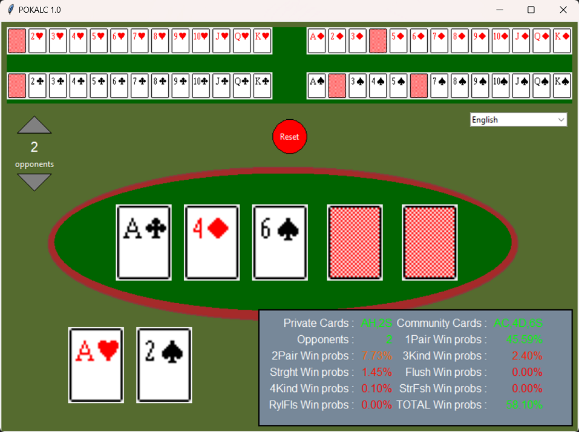

# pokalc
Poker Calculator

Simple odds calculator for Poker Texas Hold'Em. Just for fun and learning some Python. Feel free to review code or do what you want with it.



tkinter & pillow packages are needed to run it:
```
pip install tkinter
pip install pillow
```

Have fun!
